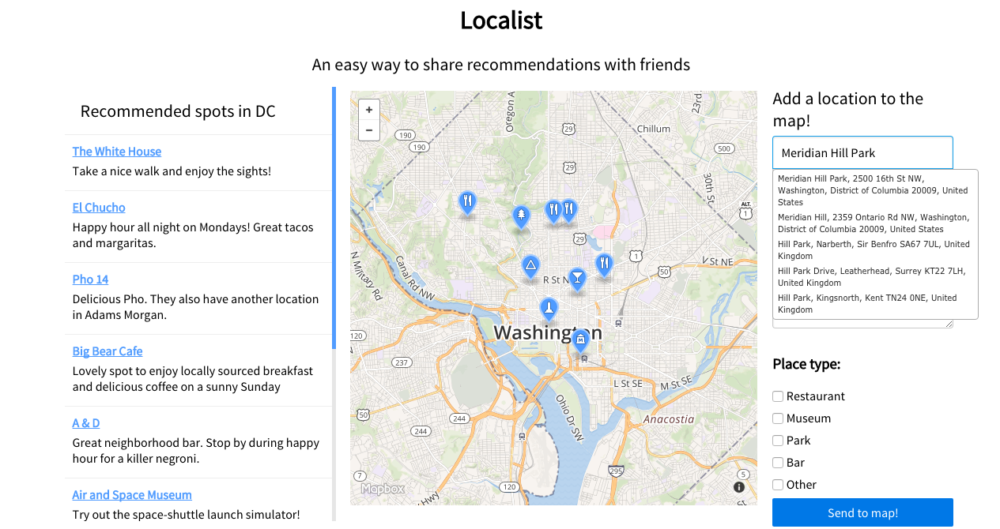
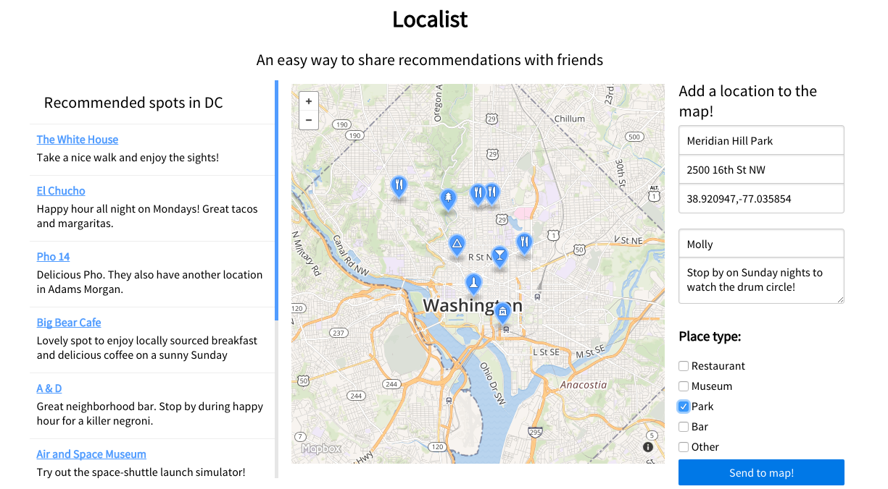

# Localist

### Summary:
Localist is an easy-to-use recommendation generator built to make it easy to share your taste with friends and followers. 

I plug in to the Mapbox API for map rendering and for geocoding and autocomplete on the 'add a location' feature. 



Instead of saving locations to your Mapbox account, this app gives you the opportunity to save your locations to a local MongoDB instance.




### Local Deployment:
To deploy a version of this app for yourself, please signup for a [Mapbox] (http://mapbox.com) Access Token and add it to `map.js`

```js
npm install
bower install
nodemon server/server.js
```


#### Built by: 

Molly Lloyd, [mollylloyd@gmail.com](mailto:mollylloyd@gmail.com)


